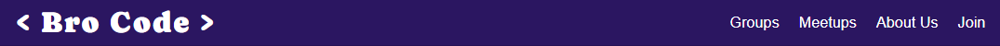
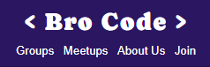
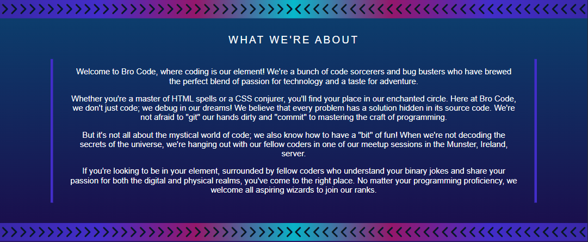
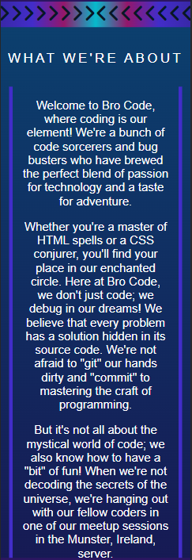
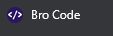
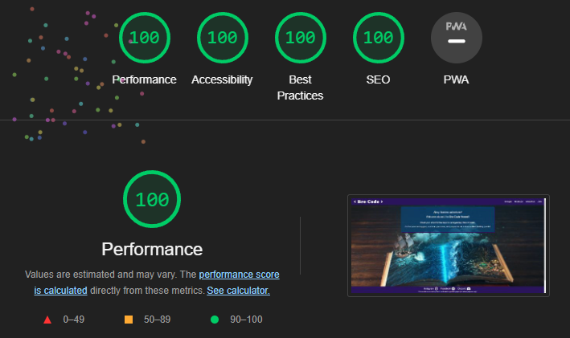
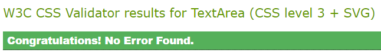

# Bro Code

## Introduction
### Bro Code - Unite, Code, Adventure!
Welcome to Bro Code, a vibrant and dynamic coding club nestled in the heart of Ireland's tech community. Our website is more than just a digital platform; it's a portal to a world where technology, camaraderie, and adventure collide.

### Live Website
The live website can be viewed [here](https://taalverena.github.io/bro-code/).

## Table of Contents

* [Site Overview](#site-overview)
* [User Stories](#user-stories)
* [Features](#features)
* [Testing](#testing)
* [Deployment](#deployment)
* [Credits](#credits)

## User Experience

### Who Bro Code Caters For
Bro Code's website is designed to cater to a diverse range of programmers who share a passion for coding, technology, and adventure. Our platform is welcoming and inclusive, making it ideal for:
* Coding Enthusiasts
* Tech Explorers
* Adventurous Spirits
* Social Learners
* Aspiring Game Knights
* Literature Lovers
* Networking Enthusiasts

Whether you're a coder, gamer, reader, explorer, or a combination of these, Bro Code invites you to join our vibrant community that celebrates coding as a way of life and embraces the spirit of adventure.

### User Stories
| User Want or Need      | How It Is Achieved | Achieved     |
| :---        |    :----:   |          ---: |
| Navigate the website easily      | Interactive navigation bar ensures that users can easily jump to different sections of the website, facilitating seamless exploration.       | [x]   |
| Find a group of like-minded programmers   | Our diverse range of groups, including Gamers, Java Beans, Book Club, Adventurers, Game Knights, and Community Code, offers a niche for every coder's interest and passion. Whether you're into gaming, literature, outdoor adventures, or collaborative coding, there's a group for you.        | [x]      |
| Have easy access to upcomning events      | The website prominently displays weekly meetups, complete with titles, dates, locations, and descriptions. This enables users to stay informed about the exciting events happening within the Bro Code community.       | [x]   |
| Be able to access the wbeiste on any device      | The website is designed with a responsive layout that adapts to various screen sizes, ensuring a seamless and user-friendly experience across devices, ranging from large desktop monitors to small mobile screens (down to 320px).       | [x]   |
| Easily contact the people behind Bro Code      | We've created a convenient signup form that allows users to express their interest and join the community. Additionally, we provide a Discord link through which users can directly engage with the organizers and fellow members, fostering an open line of communication.       | [x]   |

## Site Overview
### Explore Your Coding Passion
At Bro Code, we celebrate the diverse facets of coding. Our themed groups, including Gamers, Java Beans, Book Club, Adventurers, Game Knights, and Community Code, cater to every coding interest. Whether you're unleashing your coding prowess in epic multiplayer battles or delving into the realms of literature and adventure, there's a place for you here.

### Thrilling Meetups and Adventures
Our meetups are not your typical gatherings. Imagine conquering the Cliffs of Moher on a hiking odyssey, immersing yourself in the mystical worlds of book club evenings, or embarking on heroic Dungeons & Dragons game knight adventures. Our events are as diverse as our community, offering unforgettable experiences for every coding wizard.

### Embrace the Bro Code Spirit
Bro Code is more than just lines of code; it's a way of life. Our community embraces the magic of coding while fostering meaningful connections. We debug, collaborate, and have a "bit" of fun along the way. From novices to seasoned programmers, everyone is welcome in our enchanted circle.

### Connect and Engage
Stay connected with fellow coders beyond the screen through our social media channels. Join us on Instagram, Facebook, and Discord to share your coding journey, discover new friendships, and take part in discussions that span from algorithms to epic gaming adventures.

## Planning

### Crafting the Bro Code Experience
The journey of building the Bro Code website began with a vision to create a vibrant online space that embodies unity, adventure, and a shared love for coding. With a basic structure in mind—featuring a captivating hero image, a dynamic color scheme, and sections dedicated to groups, meetups, and -I embarked on the creative process armed using Figma wireframes.

#### Starting with the Basics
At the inception stage, I understood the importance of solid foundations. Figma provided me with a canvas to lay out the essential components of my website. My initial wireframes mapped out the core structure, highlighting the placement of the navigation bar, the hero section, and the main content areas—groups, meetups, and about us. This helped me visualize the overall layout and flow of the website, ensuring a seamless user experience.

#### Translating Vision into Design
With the hero image and vibrant color scheme as my guiding lights, I translated my vision into a tangible design. Using wireframes, I sketched out the arrangement of elements within each section, experimenting with various layouts and placements to find the perfect balance of aesthetics and functionality. This stage allowed us to iterate and refine the design ideas before diving into the detailed implementation.

#### Responsive Design for All
The commitment to crafting an inclusive experience led me to prioritize responsiveness. Recognizing the diversity of devices that users might access the website from, I set out to ensure that the design seamlessly adapts to different screen sizes—be it a larger monitor or a mobile phone. By creating wireframes for larger and smaller devices, I aimed to offer a consistent and enjoyable browsing experience for everyone.

#### Mapping the User Journey
The wireframing process also helped me visualize the user journey. As users navigate through the navigation bar, explore groups, discover upcoming meetups, and engage with the signup page, the wireframes along with my goal served as a map of this journey. It allowed me to ensure that each step is intuitive and engaging, aligning with my goal of creating a community-driven platform.

In essence, the wireframes and website goals were my compass, guiding me through the exciting process of turning an idea into my first ever website. This enabled me to envision the layout, experiment with design variations, and ensure responsiveness—ultimately shaping the Bro Code experience I'm proud to offer to coders, tech enthusiasts, and adventurers alike.

### Color Scheme
The Bro Code website's color scheme is carefully crafted to reflect the spirit of unity, adventure, and coding. Inspired by the vibrant hero image of a programmer,  our color palette is crafted to evoke a sense of  excitement that welcomes coders of all backgrounds. Each color serves a specific purpose in conveying the values and themes that define our community:

* Deep Ocean Blue:

    This color, akin to the vastness of the deep ocean, symbolizes the limitless opportunities and depths of knowledge within the coding world. It represents exploration and the thrilling journey that awaits every member as they dive into the realm of coding.

* Royal Purple:

    The royal purple shade embodies the creativity, ambition, and welcoming spirit of our community. It reflects our collective commitment to supporting one another on the path to coding excellence.

* Vibrant Indigo:

    Indigo signifies curiosity and innovation, highlighting the inquisitive nature of coders. It represents our dedication to pushing boundaries and embracing the dynamic landscape of technology.

* Enchanted Magenta:

    The enchanting magenta hue encapsulates the magic of coding, where intricate lines of code converge to create something extraordinary. It symbolizes the fusion of logical thinking and creative expression that defines our community.

*  Aquamarine Teal:

    Teal represents the harmonious blend of innovation and adventure. Just as the color transitions from blue to green, our community transitions from coding to camaraderie. It embodies our belief in collaborative learning and exploratiion.

Together, these colors unite to compose a harmonious palette that captures the essence of Bro Code. From the deep ocean blue to the captivating magenta, our color scheme encapsulates the journey of our members as they unite, code, and embark on coding adventures together.

### Figma Wireframes

#### Home
* Landing Page on Larger Devices:

    

* Landing Page on Mobiles:

    

#### Groups
* Groups Section on Larger Devices:

    

* Groups Section on Mobiles:

    

#### Meetups
* Meetups Section on Larger Devices:

    

* Meetups Section on Mobiles:

    

#### About Us
* About Us Section on Larger Devices:

    

* About Us Section on Mobiles:

    

#### Signup Page
* Signup Page on Larger Devices:

    

* Signup Page on Mobiles:

    

## Features

### Existing Features
#### Navigation Bar / Header

* The fixed header includes a navigation bar that allows seamless navigation throughout the website.
* A smooth scroll effect has been used to allow for a better user experience.
* The 'Bro Code' logo is positioned to the left-hand-side of the screen and links to the home / landing page.
* The other navigation links are positioned on the right-hand-side of the screen. These navigate to the 3 different sections ('Groups', 'Meetups' & 'About Us') as well as the signup page ('Join').
* When hovered over, the links glow to create an interactive user experience. To distinguish between the logo and the other navigation links, the logo glows in a lighter color whereas the other navigation links glow blue.
* The navigation bar is responsive to different devices and on smaller devices, the layout changes by positioning the logo in the center and the rest of the navigation links underneath the logo.
* Aria labels have been added to the navigation links to cater to all users.
* The change from the wireframe is the logo font. Caprasimo is used for the logo and Roboto for the body. Throughout the website, sans-serif is used as the default font.
  
    
    

#### Landing Page
* The landing page consists of a vibrant hero image and cover text that gives the user a clear description of what the Bro Code website is about.
* The cover text fades in to draw attention to the information and 'Unite, Code, Adventure' is in bold to give contrast to the website slogan.
* The text is large enough to be read comfortably and has a colorful background so that it stands out and flows with the color scheme of the website.
* The hero image and cover text are responsive to different devices. The hero image changes dependiing on the device size to keep the focus on the coder and the cover text re-positions to leave sufficent room to view the image.
* The start of the first section of the website, 'Groups', can be seen on the landing page to intrigue the user to scroll and read more.
* The change from the wireframe is cropping the photo to remove the red at the bottom of the image and to add cover text.

    
    

#### Groups
* The Groups section showcases the 6 existing groups Bro Code members can join. Each group has a distinct name and description that outlines the group's purpose.
* Users can explore the list of available groups and choose to join the ones that align with their interests. Alternatively, they can create their own groups based on what they're passionate about.
* The Groups section has a gradient effect from royal purple to ocean blue. This was chosen to lead the user from the purple in the landing page to the blue accents in the Meetups section that follows.
* The colors used for the groups themselves create a contrast between the background and the text, making it easily readable. These colors also flow from the magenta in the hero image to aquamarine, picking up the lighter blue shades in the Meetups section.
* The Groups section is responsive on different devices. Going from larger to medium sized devices, the groups are brought closer together and on smaller devices, the groups are flexed into a column to enusre it is easily viewable on any device.
* The changes from the wireframe include the rounded edges of the group titles, the gradient background and colorful border in the groups description. These changes were implemented to make this section stand out to the user and showcase the theme right from the beginning.

    
    

#### Meetups
* The Meetups section contains weekly Bro Code Meetups. Each section contains the meetup title, date, location, time and a description.
* The Meetups heading has a background color that matches the end gradient color of the Groups section, creating a seamless transition.
* Each meetup title has a color that corresponds with the Groups section. This gives ease of use to the user and enables them to easily find meetups matching their interests.
* These meetups are located in Ireland in person or are virtual meetups. Meetups that take place in person inlcude a link to Google Maps that opens in a separate tab and as well as aria labels to ensure inclusivivity for all users.
* A map icon has been placed next to the location for in-person meetups to draw the user's attention and make a clickable link more easily visible.
* Location links glow when hovered over in a corresponding color to the underline as well as the meetup title.
* The Meetups section is responsive on different devices. Going from larger to medium sized devices, the groups are brought closer together. On medium devices, the groups are flexed into groups of 2 meetups and on smaller devices they are flexed into a column to enusre it is easily viewable on any device.
* The changes from the wireframe include the use of color, a background image and a more crips meetup card color. These were chosen to make the meetups stand out and have a color contrast from the background image.

    
    

#### About Us
* The About Us section gives the user an overall description of what the Bro Code community is all about. It lets the user know that this is a community of programmers and that groups for all hobbies and interests are catered for.
* This setion confirms to the user that Bro Code is located in Munster, Ireland, and that all levels of programmers are welcome in our community.
* The background color used is the color gradient in the Groups section, but in reverse. This is used to take the website from the blue accents in the Meetups section to the purple color used in the footer.
* The colorful strip used at the start and end of the About Us section ties in the symbols used in the Bro Code logo as well as the colors used throughout the webiste. As this colorful feature was added, the text within this section is kept more minimal with the only other pop of color being a purple border. The border itself is again on the side as opposied to top and bottom as used in the Group section to give it a familiar, but altered affect.
* This section is responsive to different devices and uses the same layout on all devices, with the margins, padding and font adjusting for each device.
* The changesfrom the fireframe include the colorful strips, a gradient background, altered wording in the heading and a colorful border. These changes were decided on to give an overall style to the section that matches the rest of the wbsite.
  
    
    

#### Footer
* The footer uses the same color scheme and font as the header, creating a uniform design.
* A fixed footer has been utilised, ensuring smooth navigation for the user.
* To keep the footer more minimal compared to the website itself, this only contains links to social networks (Instagram, Facebook & Discord) along with a disclaimer.
* Social mdia links open in a separate tab and inlcude Font Awesome icons to give visual confirmation to the user as well as aria labels for inclusivity of all users.
* When hovered over, the links glow to create an interactive user experience. The same color has been used as the header to keep with the theme.
* The footer is responsive on different devices and increases in height on medium devices, hiding the social network names on smaller devices. This ensures that the icons and disclaimer remain visible and easily clickable on all devices.
* The changes from the wireframe inlcude the use of icons and the addition of th disclaimer. These changes have been implemented to ensure ease of use for the user.
  
    
    

#### Signup Page: Enter the Bro Code Universe
* The Bro Code Signup Page, set against a captivating portal background, provides a signup process designed to seamlessly welcome the user into the Bro Code community.
* The page enables the user to join the community following the submission of the form. The infrmation requested has been kept to the point to allow for a faster submission process and to keep the user' interest.
* Placeholder text has been utilised for the user details input elements to prompt the user and labels used throughout the form as confirmation to the user.
* The user details section has been set as 'required' as these details will be needed to send information and suggestions to the user.
* The email input has been set as an type 'email' and names given for the input elements for information collection purposes.
* A dropdown selection of counties in Munster have been provided to better enable the Bro Code team to recommend groups to the user. The option of 'Other' is also noted for users who are located abroad, but would still like to join the meetups / groups.
* The checkbox includes confirmation that the user can join more groups, change thier mind about groups selected in the signup form or create their own groups. This gives the user flexibility and allows them to make joining the community an enjoyable and personalised experience.
* The header and footer tie in with the main page to provide a seamless transition between pages.
* The Signup page is responsive on different devices and keeps a very similar layout throughout. Varied versions of the background image are used to keep the focus on the portal and padding and margins for the cover text are adjusted to seamlessly read on all devices.
* The submit button brings the user to the Thank You page detailed below.
* The changes from the wireframe includde the addition of the background images and color changes. The eye-catching portal-themed background sets the stage for the user's journey into the Bro Code realm and follows the color scheme of the main page. A varied opacity version of the familiar colors used on the main page are used as background colors for the form text. 

    
    

#### Thank You Page
* The Thank Youb Page is presented to the user after the signup form submission.
* This page is kept minimal with confirmation to the uer that the form has been submitted successfuly and that they will shortly receive an email with a Discord link. As this website wascreated for a static website porfolion project, the information is not collected or stored at this time and this page is for illustrative purposes only.
* Keeping the color theme of the man page and signup page, the same blue and purple colors are used for the Thank You page.
* The header and footer tie in with the main page to provide a seamless transition between pages.
* The Thank You page is responsive on different devices and keeps a very similar layout throughout. Varied versions of the background image are used to enusre the image remains of good quality and padding and margins for the cover text are adjusted to seamlessly read on all devices.
* This page was not included in the wireframe, but was added to tie the whole page together. The vibrant ship background continues the feel of adventure and the bright blue accents match the glow effect used for the header and footer links.

    
    

#### Favicon
* The Bro Code favicon was designed using the same purple as the header and footer as well as the symbols used in the logo.
* This was created to distinguish the website / tab from other websites the user may have open to enable them to easily navigate back to the Bro Code website.

    

### Future Features to Implement
* As this website was deisgned for a portfolio project using HTML and CSS, the information from the signup page is not collected at present. Building on this to make it functional and have a running website is a feature I would like to implement at a later stage.
* Once the webiste is in use, I would like to expand to other countries to cater to more users.
* Work with local companies and suppliers to organize group events, discounts and special offers for the Bro Code community.
* Cater the website to also be responsive on much larger devices, excluding the most commonly used device sizes that have already been catered for.

## Testing
* I tested my website on Chrome, Firefox and Edge.
* I confirmed that my website is responsive, maintains good structure and image quality, and functions as intended on all standard screen sizes using Dev Tools.
* Basic adjustments made for much larger devices.
* I tested my website on 3 different PCs, 2 different laptops and 6 different phones.
* I confirmed that the text throughout the website is easily read and understood.
* I have confirmed that the form works, requires an email address, the submit button works and takes the user to a thank you page.

### Lighthouse
I tested my website using the Lighthouse feature on Dev Tools. All 3 pages returned the desired results.

* Main Page Lighthouse Results

* Signup Page Lighthouse Results

* Thank You Page Lighthouse Results

### Validator Testing
* HTML

    I checked all 3 files and no errors were returned when passing through the official W3C validator.

    

* CSS

    I checked my CSS file and no errors were returned when passing through the official Jigsaw validator.

    

### Bugs

## Fixed Bugs
* When using Am I Responsive, I discovered a horizontal scroll bar on mobile devices.
* I inspected my code and used Unicorn Revealer to adjust my margins and width for smaller devices. This fixed the bug and the horizontal scroll bar no longer appears.

## Unfixed Bugs
* The only unfixed bug is that on 2 of the mobiles I tested my live site on, I encountered an error with the navigation links.
* When on those specific mobiles and on the home page, all section links work as intended. However, when going to the signup page and then clicking on a section link in the header, this goes to the landing page instead of the section on the main page.
* I was unable to replicate this on the other 4 mobiles I tested my website on and all testing using Dev Tools worked as intended.
* I researched this and found suggestions of adding a ? before the # in the id name, clearing the cache or using basic JavaScript. However, none of these returned the desired results.
* Further research will be done to find the fix and this will be impleneted.

## Deployment
* The repo was created using the Code Instutute template and cloned using VS Code.
* I used regular commits and ensured the commit messages were to the point and the code was sectioned into small groups of information.
* My website was deployed to GitHub pages.

## Credits

### Content
* Wireframes designed using [Figma](https://www.figma.com/)
* Markdown table layout sourced from [Markdown Guide](https://www.markdownguide.org/extended-syntax/#tables)

### Media
* Hero image sourced from [Freepik](https://img.freepik.com/free-vector/female-programmer-working-computer-night_107791-19637.jpg?w=1380&t=st=1692291332~exp=1692291932~hmac=eba727fa0d86751c47779c3de478b9d51857c78830f0460604dba32d41997e42)
* Signup page background image sourced from [Freepik](https://img.freepik.com/free-vector/magic-portal-mountain-cliff-with-flying-rocks-around_107791-4674.jpg?w=1380&t=st=1692291689~exp=1692292289~hmac=febe9ad2b8b2e31c44eb3835d8abd3e4ed95a347c0fecd8374a1f73c20903171)
* Thank you page background image sourced from [Freepik](https://img.freepik.com/free-photo/open-book-with-fairytale-scene_52683-107844.jpg?w=1380&t=st=1692291561~exp=1692292161~hmac=62c732b1d658371a3f5da45c4d1f378650b5772712731a6e1958339014aefee7)
* Images edited using [Gimp](https://www.gimp.org/)

### Color Scheme, Fonts & Icons
* Color scheme swatches sourced from and built upon [Adobe Color](https://color.adobe.com/create/image)
* Font sourced from [Google Fonts](https://fonts.google.com/)
* Icons sourced from [Font Awesome](https://fontawesome.com/)
* Website tab icon sourced from / designed on [Favicon](https://favicon.io/)

### Extensions
* [WAVE](https://chrome.google.com/webstore/detail/wave-evaluation-tool/jbbplnpkjmmeebjpijfedlgcdilocofh)
* [Unicorn Revealer](https://chrome.google.com/webstore/detail/unicorn-revealer/lmlkphhdlngaicolpmaakfmhplagoaln?hl=en-GB)

### Other
* Wording refined using [Chat GPT](https://chat.openai.com/)
* Code created and edited through [VS Code](https://code.visualstudio.com/)
